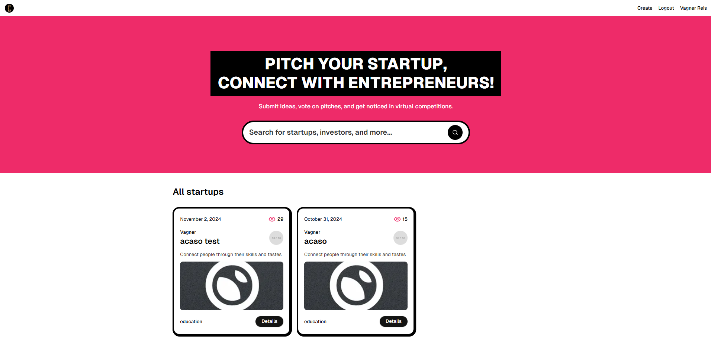
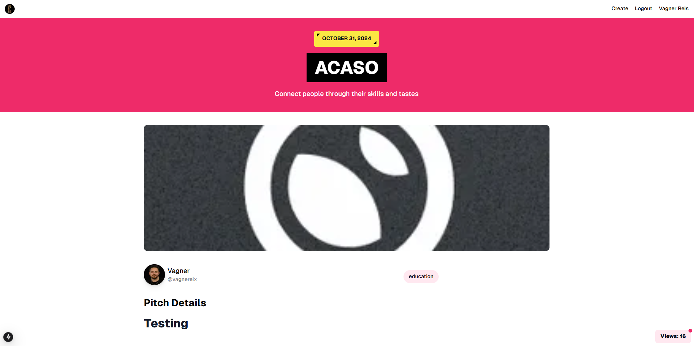
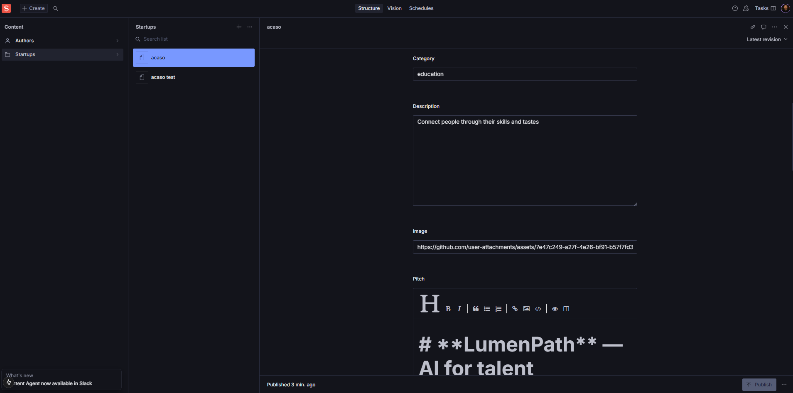

# VR Startups Directory

> Uma plataforma moderna para apresentar, votar e descobrir startups de realidade virtual. Construída com **Next.js 15**, **Sanity CMS** e **TypeScript**, oferecendo uma experiência completa de descoberta e networking.

## 🎯 Visão Geral

O **VR Startups Directory** é uma aplicação web full-stack que permite:

- 🚀 **Submeter pitches** de startups de forma interativa
- 🗳️ **Votar** em startups mais inovadoras
- 🔍 **Descobrir** novos empreendimentos através de busca avançada
- 👤 **Perfis de autores** com informações detalhadas
- 🎨 **Interface moderna** com design responsivo

### Stack Tecnológico

| Categoria | Tecnologia |
|-----------|-----------|
| **Frontend** | Next.js 15 (App Router), React 19, TypeScript |
| **Styling** | Tailwind CSS, shadcn/ui |
| **CMS** | Sanity (headless) |
| **Autenticação** | NextAuth.js 5 + GitHub OAuth |
| **Editor** | EasyMDE (Markdown) |
| **Ícones** | Lucide React, Radix UI Icons |
| **Utilitários** | Zod (validação), markdown-it, class-variance-authority |
| **Runtime** | Node.js + Turbopack |

---

## 📋 Pré-requisitos

Antes de começar, certifique-se de ter:

- **Node.js** 18+ instalado
- **pnpm** 9.12.3+ como package manager
- Uma conta no [Sanity.io](https://www.sanity.io)
- Uma aplicação OAuth GitHub (para autenticação)
- Um editor de código (VSCode recomendado)

---

## 🚀 Quick Start

### 1. Clone e Instale Dependências

```bash
git clone https://github.com/seu-usuario/vr-directory.git
cd vr-directory
pnpm install
```

### 2. Configuração Sanity + Ambiente

#### a) Criar Projeto Sanity

```bash
# Se ainda não tiver um projeto Sanity, crie um em https://manage.sanity.io

# Depois, gere as variáveis de ambiente
pnpm sanity init
```

#### b) Configurar Variáveis de Ambiente

Crie um arquivo `.env.local` na raiz do projeto:

```env
# Sanity Configuration
NEXT_PUBLIC_SANITY_PROJECT_ID=seu_project_id_aqui
NEXT_PUBLIC_SANITY_DATASET=production
NEXT_PUBLIC_SANITY_API_VERSION=2024-11-01
SANITY_WRITE_TOKEN=seu_write_token_aqui

# GitHub OAuth (NextAuth)
GITHUB_ID=seu_github_oauth_id
GITHUB_SECRET=seu_github_oauth_secret
AUTH_SECRET=uma_string_aleatoria_bem_longa
```

**Como obter essas credenciais:**

- **Sanity Project ID & API Version**: Acesse [manage.sanity.io](https://manage.sanity.io), selecione seu projeto, vá a **Settings** > **API** e copie o Project ID e API Version
- **Sanity Write Token**: Em **Settings** > **API** > **Tokens**, crie um novo token com acesso de escrita
- **GitHub OAuth**: Vá em [GitHub Developer Settings](https://github.com/settings/developers) > **OAuth Apps** > **New OAuth App**
  - Authorization callback URL: `http://localhost:3000/api/auth/callback/github`
  - Copie o `Client ID` e `Client Secret`
- **AUTH_SECRET**: Gere com `openssl rand -base64 32`

### 3. Sincronizar Schema Sanity

```bash
# Este comando extrai o schema Sanity e gera tipos TypeScript
pnpm typegen
```

### 4. Executar em Desenvolvimento

```bash
pnpm dev
```

A aplicação estará disponível em:
- **App**: http://localhost:3000
- **Sanity Studio**: http://localhost:3000/studio

---

## 🏗️ Arquitetura & Estrutura

### Estrutura de Pastas

```
vr-directory/
├── src/
│   ├── app/                       # Next.js App Router
│   │   ├── (root)/               # Layout raiz com navegação
│   │   │   ├── page.tsx          # Home - listagem de startups
│   │   │   ├── layout.tsx        # Layout raiz
│   │   │   └── startup/[id]/     # Página detalhes da startup
│   │   ├── studio/               # Sanity Studio montado em /studio
│   │   └── layout.tsx            # Root layout global
│   │
│   ├── components/               # Componentes React reutilizáveis
│   │   ├── startup-card.tsx      # Card individual de startup
│   │   ├── search-form.tsx       # Formulário de busca
│   │   ├── nav-bar.tsx           # Barra de navegação
│   │   ├── view.tsx              # Componente de views/visualizações
│   │   ├── error-boundary.tsx    # Error boundary
│   │   ├── ui/                   # Componentes UI primitivos (shadcn)
│   │   │   ├── button.tsx
│   │   │   └── skeleton.tsx
│   │   └── ...
│   │
│   ├── sanity/                   # Configuração Sanity
│   │   ├── lib/
│   │   │   ├── client.ts         # Cliente Sanity read-only (CDN)
│   │   │   ├── write-client.ts   # Cliente Sanity com permissão escrita
│   │   │   ├── live.ts           # Configuração Sanity Live Updates
│   │   │   └── queries.ts        # GROQ queries (explicadas abaixo)
│   │   │
│   │   ├── schemaTypes/          # Definições de schema Sanity
│   │   │   ├── startup.ts        # Schema: Startup (documento)
│   │   │   ├── author.ts         # Schema: Author (documento)
│   │   │   └── index.ts
│   │   │
│   │   ├── env.ts                # Variáveis de ambiente Sanity
│   │   ├── structure.ts          # Estrutura do painel Sanity
│   │   └── types/                # Tipos TypeScript gerados (auto)
│   │
│   ├── auth.ts                   # NextAuth.js configuração
│   ├── lib/                      # Utilitários
│   │   └── utils.ts
│   │
│   └── styles/                   # Estilos globais
│
├── public/                       # Assets estáticos
├── sanity.config.ts              # Configuração Sanity Studio
├── next.config.ts                # Configuração Next.js
├── package.json
└── tsconfig.json
```

---

## 📊 Sanity: Schema, Queries e Setup

### 1. Estrutura do Schema

#### **Documento: Author** (`src/sanity/schemaTypes/author.ts`)

Representa um usuário que cria startups. Sincronizado com GitHub via NextAuth.

```typescript
{
  _id: "author_id",
  id: 123456,                    // GitHub ID
  name: "João Silva",
  username: "joaosilva",
  email: "joao@example.com",
  image: "https://avatars.githubusercontent.com/...",
  bio: "Empreendedor de realidade virtual"
}
```

**Campos:**
- `id` (number): GitHub ID
- `name` (string): Nome completo
- `username` (string): Username GitHub
- `email` (string): Email
- `image` (url): Avatar do GitHub
- `bio` (text): Biografia

#### **Documento: Startup** (`src/sanity/schemaTypes/startup.ts`)

Representa uma startup ou projeto enviado por um autor.

```typescript
{
  _id: "startup_id",
  _createdAt: "2024-11-15T10:30:00Z",
  title: "VirtualMentor",
  slug: "virtual-mentor",
  description: "Plataforma de mentoria em realidade virtual",
  category: "Education",
  image: "https://example.com/image.jpg",
  views: 1250,
  pitch: "# Pitch\n\nDetalhes em markdown...",
  author: { /* reference ao documento Author */ }
}
```

**Campos:**
- `title` (string): Nome da startup
- `slug` (slug): URL-friendly (auto-gerado do title)
- `description` (text): Descrição breve (uma ou duas linhas)
- `category` (string): Categoria/nicho (ex: "Education", "Gaming", "Healthcare")
- `image` (url): URL da imagem de thumbnail
- `pitch` (markdown): Descrição detalhada em Markdown
- `views` (number): Contagem de visualizações
- `author` (reference): Link para documento Author
- `_createdAt`: Timestamp de criação (automático)

### 2. GROQ Queries Explicadas

Todas as queries estão em `src/sanity/lib/queries.ts`. GROQ (Graph-Relational Object Queries) é a linguagem de query do Sanity, similar a GraphQL.

#### **Query 1: STARTUPS_QUERY** - Listar todas as startups com filtro

```groq
*[_type == "startup" && defined(slug.current) && !defined($search) || title match $search || category match $search || author -> name match $search] | order(_createdAt desc) {
  _id, 
  _createdAt,
  title,
  slug,
  image,
  description,
  views,
  category,
  author -> {
    _id, name, image, bio
  }
}
```

**O que faz:**
1. `*[_type == "startup"]` - Seleciona todos os documentos do tipo "startup"
2. `defined(slug.current)` - Apenas startups com slug válido
3. `!defined($search) || title match $search || ...` - Sem parametro search retorna todos; com search, filtra por título, categoria ou nome do autor
4. `order(_createdAt desc)` - Ordena por data de criação (mais recentes primeiro)
5. Retorna campos específicos + autor com referência resolvida (`->`)

**Parâmetro:**
- `$search`: String de busca (null para sem filtro)

**Uso:**
```typescript
const { data: posts } = await sanityFetch({
  query: STARTUPS_QUERY,
  params: { search: "AI" }, // Busca startups com "AI"
});
```

#### **Query 2: STARTUP_BY_ID_QUERY** - Obter startup por ID

```groq
*[_type == "startup" && _id == $id][0] {
  _id, 
  _createdAt,
  title,
  slug,
  image,
  description,
  views,
  category,
  pitch,
  author -> {
    _id, name, username, image, bio
  }  
}
```

**O que faz:**
1. Encontra a startup com ID específico
2. `[0]` - Retorna apenas o primeiro (e único) resultado
3. Inclui o `pitch` completo (não incluído na listagem)
4. Resolve referência do autor

**Parâmetro:**
- `$id`: ID da startup

**Uso:**
```typescript
const post = await client.fetch(STARTUP_BY_ID_QUERY, { id: "abc123" });
```

#### **Query 3: STARTUP_VIEWS_QUERY** - Atualizar contagem de visualizações

```groq
*[_type == "startup" && _id == $id][0] {
  _id, views
}
```

**O que faz:**
- Busca apenas `_id` e `views` para atualização leve

#### **Query 4: AUTHOR_BY_GITHUB_ID_QUERY** - Buscar autor por GitHub ID

```groq
*[_type == "author" && _id == $id][0] {
  _id, id, name, username, image, email, bio
}
```

**Uso:** No callback NextAuth ao fazer login - verifica se autor já existe

#### **Query 5: AUTHOR_BY_GITHUB_EMAIL_QUERY** - Buscar autor por email

```groq
*[_type == "author" && email == $email][0] {
  _id,
}
```

**Uso:** No JWT callback NextAuth para associar sessão

---

## 🔧 Como Usar as Queries

### Em Server Components (Recomendado)

```typescript
import { sanityFetch } from "@/sanity/lib/live";
import { STARTUPS_QUERY } from "@/sanity/lib/queries";

export default async function Home() {
  const { data: posts } = await sanityFetch({
    query: STARTUPS_QUERY,
    params: { search: null },
  });
  
  return (
    <ul>
      {posts.map(post => (
        <li key={post._id}>{post.title}</li>
      ))}
    </ul>
  );
}
```

### Com Busca Dinâmica

```typescript
export default async function Home({ searchParams }) {
  const query = (await searchParams).query;
  
  const { data: posts } = await sanityFetch({
    query: STARTUPS_QUERY,
    params: { search: query ?? null }, // null = sem filtro
  });
  
  return posts.length ? "Resultados encontrados" : "Nenhum resultado";
}
```

### Com Write Client (Criar/Atualizar)

```typescript
import { writeClient } from "@/sanity/lib/write-client";

// Criar nova startup
await writeClient.create({
  _type: "startup",
  title: "Minha Startup",
  category: "AI",
  description: "...",
  image: "https://...",
  author: { _type: "reference", _ref: "author_id" },
});

// Atualizar views
await writeClient.patch("startup_id").set({ views: 100 }).commit();
```

---

## 🔐 Autenticação com GitHub (NextAuth.js)

A autenticação é configurada em `src/auth.ts` usando **NextAuth.js 5 com GitHub OAuth**.

### Fluxo:

1. **Usuário clica "Sign in with GitHub"**
2. **GitHub OAuth Callback** → NextAuth
3. **signIn callback**: 
   - Busca autor no Sanity por GitHub ID
   - Se não existe, cria novo documento Author
4. **JWT callback**: Adiciona Sanity author ID ao token
5. **Session callback**: Adiciona ID à sessão
6. **Usuário autenticado** com acesso a `session.id` em qualquer lugar

### Verificar Autenticação

```typescript
import { auth } from "@/auth";

export default async function Page() {
  const session = await auth();
  
  if (!session) {
    return <p>Faça login primeiro</p>;
  }
  
  return <p>Bem-vindo, {session.user?.name}!</p>;
}
```

---

## 🛠️ Desenvolvimento

### Comandos Disponíveis

```bash
# Desenvolvimento com Turbopack (rápido)
pnpm dev

# Build para produção
pnpm build

# Iniciar servidor de produção
pnpm start

# Lint do código
pnpm lint

# Regenerar tipos TypeScript do Sanity
pnpm typegen
```

### Sanity Studio

Acesse **http://localhost:3000/studio** enquanto o dev server está rodando.

**Ações no Studio:**
- ✏️ Criar/editar startups
- ✏️ Gerenciar autores
- 🖼️ Upload de imagens
- 🔍 GROQ Vision: testar queries em tempo real

---

## 🎨 Componentes Principais

### StartupCard

Renderiza card individual de startup na home.

```typescript
<StartupCard post={startupData} />
```

**Props:**
- `post`: Objeto Startup com autor

### SearchForm

Formulário de busca que usa `next/form` (Server Action).

**Features:**
- Input de busca em tempo real
- Botão reset se houver query

### View Component

Rastreia visualizações de startup (Suspense + Error Boundary).

---

## 📱 Features

### ✅ Implementadas

- [x] Listagem de startups com paginação
- [x] Busca por título, categoria e autor
- [x] Autenticação GitHub + NextAuth
- [x] Painel de admin Sanity Studio
- [x] Descrições em Markdown com EasyMDE
- [x] Rastreamento de visualizações
- [x] Responsive design (mobile-first)
- [x] Type-safe queries (TypeScript)
- [x] Live updates (Sanity Live)

### 🚀 Próximos Passos

- [ ] Sistema de votação/likes
- [ ] Perfil de autor com histórico
- [ ] Comentários nas startups
- [ ] Notificações em tempo real
- [ ] Export para PDF
- [ ] Integração com email marketing

---

## 📸 Screenshots

Exemplos da interface (arquivos em [`.github/`](.github/)):

### Página inicial — listagem e busca



### Detalhe da startup — pitch e autor



### Sanity Studio — CMS embutido



---

## 🌐 Deploy

### Vercel (Recomendado)

```bash
vercel deploy
```

Passo a passo:
1. Conecte seu repositório GitHub ao Vercel
2. Configure variáveis de ambiente no painel Vercel
3. Deploy automático em cada push para `main`

### Variáveis de Ambiente (Produção)

As mesmas do desenvolvimento:
```
NEXT_PUBLIC_SANITY_PROJECT_ID
NEXT_PUBLIC_SANITY_DATASET
NEXT_PUBLIC_SANITY_API_VERSION
SANITY_WRITE_TOKEN
GITHUB_ID
GITHUB_SECRET
AUTH_SECRET
```

---

## 📚 Documentação Referenciada

- [Next.js 15 Docs](https://nextjs.org/docs)
- [Sanity Documentation](https://www.sanity.io/docs)
- [NextAuth.js 5](https://authjs.dev)
- [GROQ Query Language](https://www.sanity.io/docs/groq)
- [Tailwind CSS](https://tailwindcss.com)

---

## 📝 Licença

MIT License - sinta-se livre para usar este projeto como base.

---

## 🤝 Contribuindo

Contribuições são bem-vindas! Por favor:

1. Faça um fork do projeto
2. Crie uma branch para sua feature (`git checkout -b feature/nova-feature`)
3. Commit suas mudanças (`git commit -m 'Add nova feature'`)
4. Push para a branch (`git push origin feature/nova-feature`)
5. Abra um Pull Request

---

## ❓ FAQ

### Como adicionar campos ao schema?

Edit em `src/sanity/schemaTypes/startup.ts`, depois rode:
```bash
pnpm typegen
```

### Como debugar queries GROQ?

Use o Vision plugin no Sanity Studio (`/studio`) e teste queries em tempo real.

### Posso usar outro provedor OAuth além de GitHub?

Sim! NextAuth suporta 100+. Veja [NextAuth Providers](https://authjs.dev/getting-started/providers).

### Como revalidar cache após criar nova startup?

Use On-Demand ISR (configurado automaticamente com `sanityFetch`).

---

**Made with ❤️ by VR Startups Team**
